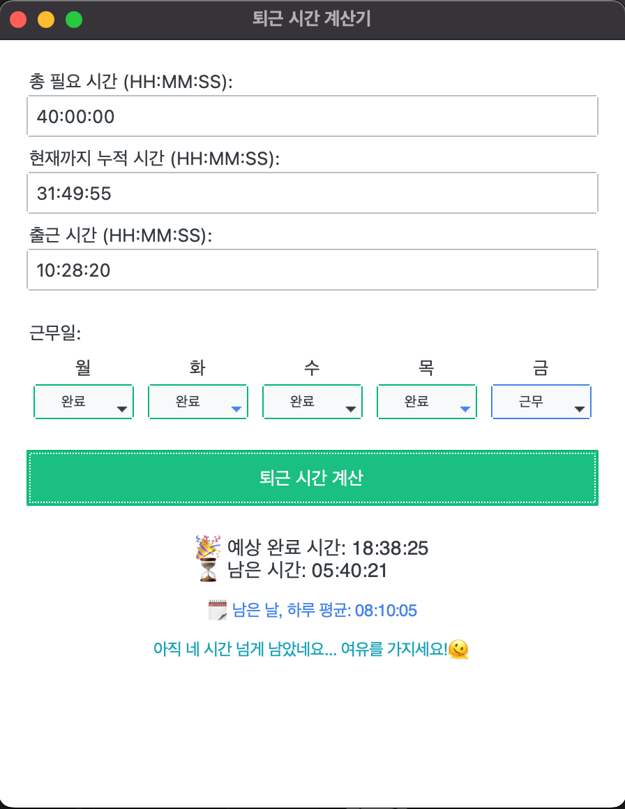

# 퇴근 시간 계산기

- gemini cli와 Vibe 코딩 해보기(~~vibe coding이 느좋코딩 이래요~~)
- 해당 코드는 퇴근 시간을 계산하는 프로그램입니다. 사용자는 총 필요 시간, 누적 시간, 출근 시간을 입력하여 퇴근 시간을 계산할 수 있습니다.
- 또한, 잔여 근무 시간을 기반으로 남은 근무일의 평균 퇴근 시간을 예측하고, 격려 메시지를 제공합니다.

## 개발 환경

## 사용법

### 설치

1. 이 저장소를 클론합니다.
2. (선택) 가상 환경을 설정합니다. 예: `python -m venv .venv`
3. `pip install -r requirements.txt`를 사용해 필요한 패키지를 설치합니다.
4. (선택) `.ini`파일을 수정하여 커스터마이징을 진행합니다.
5. (선택) `install.sh`(MacOS) 또는 `install.bat`(Windows)를 실행하여 실행 파일을 설치합니다.

### 실행

- python 사용 시: `python main.py`를 실행하여 프로그램을 시작합니다.
- 실행 파일 사용 시: `leave-clock` 명령어를 사용하거나 `leave-clock.app` 파일을 실행합니다.(실행 파일로 실행할 경우 지연 시간이 발생할 수 있습니다.)

### 버그

- python으로 실행 시 앱 아이콘이 표시되지 않는 버그가 있습니다. 이는 Python의 `tkinter` 라이브러리에서 발생하는 문제로, 실행 파일로 실행할 경우에는 정상적으로 표시됩니다.
